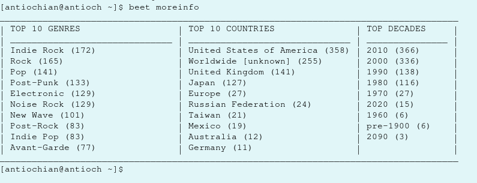

# beets-moreinfo-plugin
Plugin to pull metadata breakdown of off a  database (A music storage/tagging application)

This is a small plugin I wrote for the beets autotagger to give me interesting information about my offline music collection.
It adds a new command to the beets program, "moreinfo" and works just by querying the beets metadata SQL database.

Example usage:

The only reason its worthy to be included on my github is that is the first program I've ever made that slots neatly into an existing piece of software as an additional plugin, rather than being a standalone implementation like my other projects.
